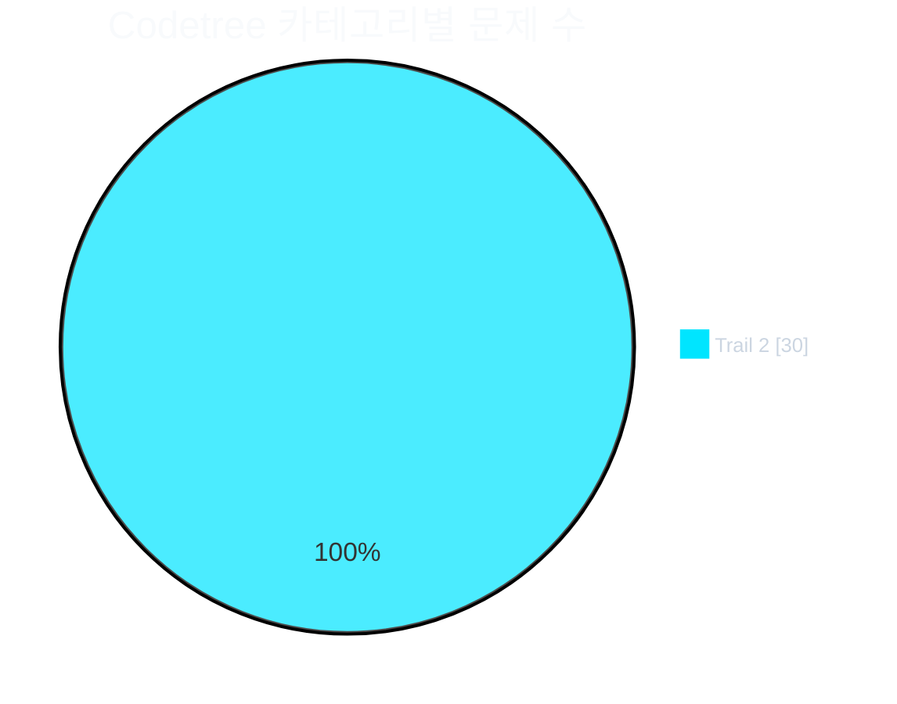
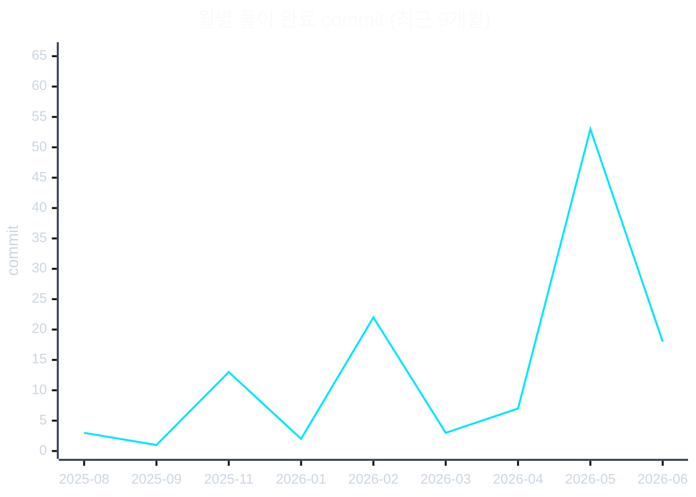

  

  

  
  
  

# 알고리즘 공부 저장소

## 📊 한눈에 보기

| 플랫폼 | 문제 수 |
| --- | ---: |
| BaekJoon | 84 |
| SW Expert Academy | 17 |
| Codetree | 30 |
| Algospot | 17 |
| Programmers | 19 |
| Softeer | 1 |
| **합계** | **168** |

### 카테고리 분포 (Codetree)

### 🛤️ Codetree Trail 진도

| Trail | 진도 | 카운트 |
| --- | --- | --- |
| **Trail 2** | _전체 문제 수 미설정_ | **30** solved |

### 🎯 정복한 난관 (Codetree 도전 기록 Top 5)

| 문제 | 시도 | 과정 |
| --- | ---: | --- |
| 만나는 그 순간 | 8 | ❌×7 → ✅ |
| 연속되는 수 2 | 8 | ❌×4 → ✅ → ❌×2 → ✅ |
| 요일 맞추기 | 7 | ⏱️×4 → ❌×2 → ✅ |
| 잔해물을 덮기 위한 사각형의 최소 넓이 | 6 | ❌×4 → ✅×2 |
| 왔다 갔던 구역 2 | 5 | ❌×4 → ✅ |

### 📅 학습 타임라인

> ### 📅 오늘의 복습 추천 문제 (Spaced Repetition)
> **시철이가 사랑한 GCD** (BaekJoon · Gold IV)
> - **추천 사유**: 정기 학습 복습 및 망각 방지
> - **풀이 코드**: [BaekJoon/21870](./BaekJoon/Divide_Conquer/21870)

## 폴더 구조
- **Algospot/**: Algospot 문제 풀이
- **BaekJoon/**: 백준 온라인 저지 문제. 바킹독 0x 시리즈 로드맵을 따라 분류.
- **Codetree/**: 코드트리 문제 (구현·트레일 코스 등)
- **Programmers/**: 프로그래머스 코딩 테스트 문제
- **Softeer/**: 현대 Softeer 문제
- **SW Expert Academy/**: SW Expert Academy 문제
- **Python Study/**: 파이썬 연습 코드
- **scripts/**: README 자동 생성 파이프라인

## BaekJoon 문제 정리

`BaekJoon/` 폴더는 알고리즘 유형별로 세분화되어 있으며 각 문제는 백준 번호로 된 하위 폴더에 저장되어 있습니다.

<b>0x0B · 재귀</b>

| 번호 | 제목 | 난이도 |
| --- | --- | --- |
| 1074 | Z | Silver I |
| 1629 | 곱셈 | Silver I |
| 11729 | 하노이 탑 이동 순서 | Silver I |

<b>0x0C · 백트래킹</b>

| 번호 | 제목 | 난이도 |
| --- | --- | --- |
| 1182 | 부분수열의 합 | Silver II |
| 6603 | 로또 | Silver II |
| 9663 | N-Queen | Gold IV |
| 15649 | N과 M (1) | Silver III |

<b>0x10 · 다이나믹 프로그래밍</b>

| 번호 | 제목 | 난이도 |
| --- | --- | --- |
| 1149 | RGB거리 | Silver I |
| 2579 | 계단 오르기 | Silver III |

<b>BFS / DFS</b>

| 번호 | 제목 | 난이도 |
| --- | --- | --- |
| 1012 | 유기농 배추 | Silver II |
| 1194 | 달이 차오른다, 가자 | Gold I |
| 1260 | DFS와 BFS | Silver II |
| 1697 | 숨바꼭질 | Silver I |
| 2023 | 신기한 소수 | Gold IV |
| 2146 | 다리 만들기 | Gold IV |
| 2178 | 미로 탐색 | Silver I |
| 2206 | 벽 부수고 이동하기 | Gold III |
| 2606 | 바이러스 | Silver III |
| 2644 | 촌수계산 | Silver II |
| 4179 | 불! | Gold IV |
| 7576 | 토마토 | Gold V |
| 11724 | 연결 요소의 개수 | Silver II |
| 13023 | ABCDE | Gold V |
| 13460 | 구슬 탈출 2 | Gold I |
| 14503 | 로봇 청소기 | Gold V |

<b>Backtracking</b>

| 번호 | 제목 | 난이도 |
| --- | --- | --- |
| 1759 | 암호 만들기 | Gold V |
| 2023 | 신기한 소수 | Gold IV |
| 10971 | 외판원 순회 2 | Silver II |
| 15649 | N과 M (1) | Silver III |
| 17136 | 색종이 붙이기 | Gold II |

<b>Bellman-Ford</b>

| 번호 | 제목 | 난이도 |
| --- | --- | --- |
| 1219 | 오민식의 고민 | Platinum V |
| 11657 | 타임머신 | Gold IV |

<b>Binary Search</b>

| 번호 | 제목 | 난이도 |
| --- | --- | --- |
| 1822 | 차집합 | Silver IV |
| 8983 | 사냥꾼 | Gold IV |
| 16401 | 과자 나눠주기 | Silver II |

<b>Dynamic Programming</b>

| 번호 | 제목 | 난이도 |
| --- | --- | --- |
| 1029 | 그림 교환 | Gold I |
| Kth | 사전 (1256) | Gold II |
| 10942 | 팰린드롬? | Gold IV |
| 12869 | 뮤탈리스크 | Gold V |

<b>Dijkstra</b>

| 번호 | 제목 | 난이도 |
| --- | --- | --- |
| 1753 | 최단경로 | Gold IV |
| 1854 | K번째 최단경로 찾기 | Platinum V |
| 1916 | 최소비용 구하기 | Gold V |
| 11779 | 최소비용 구하기 2 | Gold III |

<b>Divide & Conquer</b>

| 번호 | 제목 | 난이도 |
| --- | --- | --- |
| 1030 | 프렉탈 평면 | Gold V |
| 2261 | 가장 가까운 두 점 | Gold II |
| 2339 | 석판 자르기 | Gold I |
| 2447 | 별 찍기 - 10 | Gold V |
| 4779 | 칸토어 집합 | Silver III |
| 5904 | Moo 게임 | Silver III |
| 6549 | 히스토그램에서 가장 큰 직사각형 | Platinum V |
| 21870 | 시철이가 사랑한 GCD | Gold IV |

<b>Floyd-Warshall</b>

| 번호 | 제목 | 난이도 |
| --- | --- | --- |
| 1389 | 케빈 베이컨의 6단계 법칙 | Silver I |
| 11404 | 플로이드 | Gold IV |

<b>Greedy</b>

| 번호 | 제목 | 난이도 |
| --- | --- | --- |
| 1202 | 보석 도둑 | Gold II |
| 1700 | 멀티탭 스케줄링 | Gold I |
| 1715 | 카드 정렬하기 | Gold IV |
| 1744 | 수 묶기 | Gold IV |
| 13305 | 주유소 | Silver IV |
| 13904 | 과제 | Gold III |

<b>Hash</b>

| 번호 | 제목 | 난이도 |
| --- | --- | --- |
| 9375 | 패션왕 신해빈 | Silver III |

<b>Implement (시뮬레이션)</b>

| 번호 | 제목 | 난이도 |
| --- | --- | --- |
| 1244 | 스위치 켜고 끄기 | Silver IV |
| 1417 | 국회의원 선거 | Silver III |
| 16234 | 인구 이동 | Gold IV |
| 17952 | 과제는 끝나지 않아!! | Silver IV |
| 19236 | 청소년 상어 | Gold I |
| 200057 | 마법사 상어와 토네이도 (20057) | Gold III |
| Mining | 광물 캐기 | - |

<b>MST</b>

| 번호 | 제목 | 난이도 |
| --- | --- | --- |
| 1197 | 최소 스패닝 트리 | Gold IV |
| 1414 | 불우이웃돕기 | Gold III |
| 17472 | 다리 만들기 2 | Gold I |

<b>Prefix Sum</b>

| 번호 | 제목 | 난이도 |
| --- | --- | --- |
| 2559 | 수열 | Silver III |
| 11659 | 구간 합 구하기 4 | Silver III |

<b>Recursive</b>

| 번호 | 제목 | 난이도 |
| --- | --- | --- |
| 1074 | Z | Silver I |
| 11729 | 하노이 탑 이동 순서 | Silver I |

<b>Sort</b>

| 번호 | 제목 | 난이도 |
| --- | --- | --- |
| 1181 | 단어 정렬 | Silver V |
| 11651 | 좌표 정렬하기 2 | Silver V |

<b>Stack</b>

| 번호 | 제목 | 난이도 |
| --- | --- | --- |
| 9012 | 괄호 | Silver IV |

<b>Topological Sort</b>

| 번호 | 제목 | 난이도 |
| --- | --- | --- |
| 1516 | 게임 개발 | Gold III |
| 1948 | 임계경로 | Platinum V |
| 2252 | 줄 세우기 | Gold III |

<b>Two Pointers</b>

| 번호 | 제목 | 난이도 |
| --- | --- | --- |
| 1253 | 좋다 | Gold IV |
| 2018 | 수들의 합 5 | Silver V |

<b>Union Find</b>

| 번호 | 제목 | 난이도 |
| --- | --- | --- |
| 1717 | 집합의 표현 | Gold V |

<b>Unsolved</b>

| 번호 | 제목 | 난이도 |
| --- | --- | --- |
| 1864 | 문어 숫자 (미해결) | Bronze |

## SW Expert Academy 문제 정리

| 번호 | 제목 | 난이도 |
| --- | --- | --- |
| 1206 | View | D3 |
| 1208 | Flatten | D3 |
| 1210 | Ladder1 | D4 |
| 1220 | Magnetic | D3 |
| 1226 | 미로1 | D4 |
| 1238 | Contact | D4 |
| 1244 | 최대 상금 | D3 |
| 1247 | 최적 경로 | D5 |
| 1767 | 프로세서 연결하기 | - |
| 1873 | 상호의 배틀필드 | D3 |
| 1954 | 달팽이 숫자 | D2 |
| 2001 | 파리 퇴치 | D2 |
| 2805 | 농작물 수확하기 | D3 |
| 13460 | 구슬 탈출 2 (BOJ) | Gold I |
| 14557 | Memory (BOJ) | Platinum I |
| 17301 | NC 문자열 (BOJ) | Platinum IV |
| 43238 | 입국 심사 (BOJ) | Gold V |
| 1209 | Sum | D3 |
| 1213 | String | D3 |
| 1215 | 회문1 | D3 |
| 1217 | 거듭 제곱 | D3 |
| 1218 | 괄호 짝짓기 | D4 |
| 1219 | 길찾기 | D4 |
| 1221 | GNS | D3 |
| 1224 | 계산기3 | D4 |
| 1225 | 암호생성기 | D3 |
| 5215 | 햄버거 다이어트 | D3 |

## Codetree 문제 정리

| 트레일 | 문제 |
| --- | --- |
| Trail 2 | 2진수로 변환하기 |
| Trail 2 | Date to Date |
| Trail 2 | DateTime to DateTime |
| Trail 2 | Time to Time |
| Trail 2 | T를 초과하는 연속 부분 수열 |
| Trail 2 | 겹치지 않는 사각형의 넓이 |
| Trail 2 | 계속 중첩되는 사각형 |
| Trail 2 | 그 요일은 |
| Trail 2 | 만나는 그 순간 |
| Trail 2 | 벌금은 누구에게 |
| Trail 2 | 블럭쌓는 명령2 |
| Trail 2 | 사각형의 총 넓이 2 |
| Trail 2 | 색종이의 총 넓이 |
| Trail 2 | 선두를 지켜라 |
| Trail 2 | 신기한 타일 뒤집기 |
| Trail 2 | 십진수로 변환하기 |
| Trail 2 | 십진수와 이진수 2 |
| Trail 2 | 악수와 전염병의 상관관계 2 |
| Trail 2 | 여러가지 진수변환 |
| Trail 2 | 연속되는 수 2 |
| Trail 2 | 연속되는 수 3 |
| Trail 2 | 연속되는 수 4 |
| Trail 2 | 왔다 갔던 구역 2 |
| Trail 2 | 요일 맞추기 |
| Trail 2 | 잔해물을 덮기 위한 사각형의 최소 넓이 |
| Trail 2 | 좌우로 움직이는 로봇 |
| Trail 2 | 진수 to 진수 |
| Trail 2 | 최대로 겹치는 구간 |
| Trail 2 | 최대로 겹치는 지점 |
| Trail 2 | 흰검 칠하기 |

## Algospot 문제 정리

| 문제 ID | 제목 |
| --- | --- |
| ALLERGY | 알러지가 심한 친구들 |
| ARCTIC | 남극 기지 |
| BOARDCOVER2 | 게임판 덮기 2 |
| CANADATRIP | 캐나다 여행 |
| DARPA | DARPA Grand Challenge |
| FENCE | 울타리 잘라내기 |
| JLIS | 합친 LIS |
| JOSEPHUS | 조세푸스 문제 |
| LAUNCHBOX | 도시락 데우기 (LUNCHBOX) |
| LOAN | 전세금 균등상환 |
| MATCHORDER | 출전 순서 정하기 |
| MINASTIRITH | 미나스 아노르 |
| Quantization | 양자화 (Quantization) |
| ROOTS | 단변수 다항 방정식 해결하기 |
| STRJOIN | 문자열 합치기 |
| WILDCARD | Wildcard |
| WITHDRAWAL | 수강 철회 |

## Programmers 문제 정리

| 문제 번호 | 제목 | 난이도 |
| --- | --- | --- |
| 1844 | 게임 맵 최단 거리 | Level 2 |
| 12941 | 최솟값 만들기 | Level 2 |
| 12979 | 기지국 설치 | Level 3 |
| 18118 | 7-세그먼트 디스플레이 | - |
| 42577 | 전화번호 목록 | Level 2 |
| 42578 | 위장 | Level 2 |
| 42888 | 오픈채팅방 | Level 2 |
| 42895 | N으로 표현 | Level 3 |
| 43162 | 네트워크 | Level 3 |
| 64065 | 튜플 | Level 2 |
| 70129 | 이진 변환 반복하기 | Level 2 |
| 72410 | 신규 아이디 추천 | Level 1 |
| 72413 | 합승 택시 요금 | Level 3 |
| 87694 | 아이템 줍기 | Level 3 |
| 92344 | 파괴되지 않은 건물 | Level 3 |
| 138476 | 귤 고르기 | Level 2 |
| 161988 | 연속 펄스 부분 수열의 합 | Level 3 |
| 178871 | 달리기 경주 | Level 1 |
| 2023 KAKAO BLIND RECRUITMENT | 개인정보 수집 유효기간 (150370) | Level 1 |

## Softeer 문제 정리

| 문제 번호 | 제목 | 난이도 |
| --- | --- | --- |
| 7594 | 나무 조경 | Level 2 |

## 바킹독 0x 시리즈 로드맵

폴더가 존재하면 ✅, 진행 예정이면 ⬜.

- ⬜ 0x00강 - 오리엔테이션
- ⬜ 0x01강 - 기초 코드 작성 요령 I
- ⬜ 0x02강 - 기초 코드 작성 요령 II
- ⬜ 0x03강 - 배열
- ⬜ 0x04강 - 연결 리스트
- ⬜ 0x05강 - 스택
- ⬜ 0x06강 - 큐
- ⬜ 0x07강 - 덱
- ⬜ 0x08강 - 스택의 활용(수식의 괄호 쌍)
- ✅ 0x09강 - BFS
- ✅ 0x0A강 - DFS
- ✅ 0x0B강 - 재귀
- ✅ 0x0C강 - 백트래킹
- ✅ 0x0D강 - 시뮬레이션
- ✅ 0x0E강 - 정렬 I
- ⬜ 0x0F강 - 정렬 II
- ✅ 0x10강 - 다이나믹 프로그래밍
- ✅ 0x11강 - 그리디
- ⬜ 0x12강 - 수학
- ✅ 0x13강 - 이분탐색
- ✅ 0x14강 - 투 포인터
- ✅ 0x15강 - 해시
- ⬜ 0x16강 - 이진 검색 트리
- ⬜ 0x17강 - 우선순위 큐
- ⬜ 0x18강 - 그래프
- ⬜ 0x19강 - 트리
- ✅ 0x1A강 - 위상정렬
- ✅ 0x1B강 - 최소 신장 트리
- ✅ 0x1C강 - 플로이드 알고리즘
- ✅ 0x1D강 - 다익스트라 알고리즘
- ⬜ 0x1E강 - KMP 알고리즘
- ⬜ 0x1F강 - 트라이
- ⬜ 부록 A - 문자열 기초
- ⬜ 부록 B - 동적 배열
- ⬜ 부록 C - 비트마스킹
- ✅ 부록 D - Union Find
- ⬜ 부록 E - 다이나믹 프로그래밍 심화
