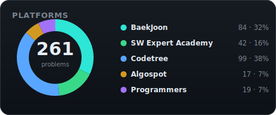
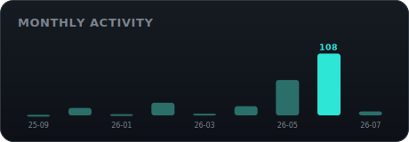
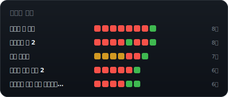

  

# 알고리즘 공부 저장소

## 🌳 Codetree (메인 트랙)

 

 

 

 

## 📊 전체 현황

 

 

> ### 📅 오늘의 복습 추천 문제 (Spaced Repetition)
> **좌우로 움직이는 로봇** (Codetree · Trail 2)
> - **추천 사유**: 이전 풀이 시 4회 실패/재시도 기록 있음 (❌×3 → ✅)
> - **풀이 코드**: [Codetree/좌우로 움직이는 로봇](./Codetree/trail2/%EC%A2%8C%EC%9A%B0%EB%A1%9C%20%EC%9B%80%EC%A7%81%EC%9D%B4%EB%8A%94%20%EB%A1%9C%EB%B4%87)

## 폴더 구조
- **Algospot/**: Algospot 문제 풀이
- **BaekJoon/**: 백준 온라인 저지 문제. 바킹독 0x 시리즈 로드맵을 따라 분류.
- **Codetree/**: 코드트리 문제 (구현·트레일 코스 등)
- **Programmers/**: 프로그래머스 코딩 테스트 문제
- **SW Expert Academy/**: SW Expert Academy 문제
- **Python Study/**: 파이썬 연습 코드
- **scripts/**: README 자동 생성 파이프라인

## BaekJoon 문제 정리

`BaekJoon/` 폴더는 알고리즘 유형별로 세분화되어 있으며 각 문제는 백준 번호로 된 하위 폴더에 저장되어 있습니다.

📁 <b>0x0B · 재귀</b> · 3문제

| 번호 | 제목 | 난이도 |
| --- | --- | --- |
| 1074 | Z | Silver I |
| 1629 | 곱셈 | Silver I |
| 11729 | 하노이 탑 이동 순서 | Silver I |

📁 <b>0x0C · 백트래킹</b> · 4문제

| 번호 | 제목 | 난이도 |
| --- | --- | --- |
| 15649 | N과 M (1) | Silver III |
| 1182 | 부분수열의 합 | Silver II |
| 6603 | 로또 | Silver II |
| 9663 | N-Queen | Gold IV |

📁 <b>0x10 · 다이나믹 프로그래밍</b> · 2문제

| 번호 | 제목 | 난이도 |
| --- | --- | --- |
| 2579 | 계단 오르기 | Silver III |
| 1149 | RGB거리 | Silver I |

📁 <b>BFS / DFS</b> · 16문제

| 번호 | 제목 | 난이도 |
| --- | --- | --- |
| 2606 | 바이러스 | Silver III |
| 1012 | 유기농 배추 | Silver II |
| 1260 | DFS와 BFS | Silver II |
| 2644 | 촌수계산 | Silver II |
| 11724 | 연결 요소의 개수 | Silver II |
| 1697 | 숨바꼭질 | Silver I |
| 2178 | 미로 탐색 | Silver I |
| 7576 | 토마토 | Gold V |
| 13023 | ABCDE | Gold V |
| 14503 | 로봇 청소기 | Gold V |
| 2023 | 신기한 소수 | Gold IV |
| 2146 | 다리 만들기 | Gold IV |
| 4179 | 불! | Gold IV |
| 2206 | 벽 부수고 이동하기 | Gold III |
| 1194 | 달이 차오른다, 가자 | Gold I |
| 13460 | 구슬 탈출 2 | Gold I |

📁 <b>Backtracking</b> · 5문제

| 번호 | 제목 | 난이도 |
| --- | --- | --- |
| 15649 | N과 M (1) | Silver III |
| 10971 | 외판원 순회 2 | Silver II |
| 1759 | 암호 만들기 | Gold V |
| 2023 | 신기한 소수 | Gold IV |
| 17136 | 색종이 붙이기 | Gold II |

📁 <b>Bellman-Ford</b> · 2문제

| 번호 | 제목 | 난이도 |
| --- | --- | --- |
| 11657 | 타임머신 | Gold IV |
| 1219 | 오민식의 고민 | Platinum V |

📁 <b>Binary Search</b> · 3문제

| 번호 | 제목 | 난이도 |
| --- | --- | --- |
| 1822 | 차집합 | Silver IV |
| 16401 | 과자 나눠주기 | Silver II |
| 8983 | 사냥꾼 | Gold IV |

📁 <b>Dynamic Programming</b> · 4문제

| 번호 | 제목 | 난이도 |
| --- | --- | --- |
| 12869 | 뮤탈리스크 | Gold V |
| 10942 | 팰린드롬? | Gold IV |
| Kth | 사전 (1256) | Gold II |
| 1029 | 그림 교환 | Gold I |

📁 <b>Dijkstra</b> · 4문제

| 번호 | 제목 | 난이도 |
| --- | --- | --- |
| 1916 | 최소비용 구하기 | Gold V |
| 1753 | 최단경로 | Gold IV |
| 11779 | 최소비용 구하기 2 | Gold III |
| 1854 | K번째 최단경로 찾기 | Platinum V |

📁 <b>Divide & Conquer</b> · 8문제

| 번호 | 제목 | 난이도 |
| --- | --- | --- |
| 4779 | 칸토어 집합 | Silver III |
| 5904 | Moo 게임 | Silver III |
| 1030 | 프렉탈 평면 | Gold V |
| 2447 | 별 찍기 - 10 | Gold V |
| 21870 | 시철이가 사랑한 GCD | Gold IV |
| 2261 | 가장 가까운 두 점 | Gold II |
| 2339 | 석판 자르기 | Gold I |
| 6549 | 히스토그램에서 가장 큰 직사각형 | Platinum V |

📁 <b>Floyd-Warshall</b> · 2문제

| 번호 | 제목 | 난이도 |
| --- | --- | --- |
| 1389 | 케빈 베이컨의 6단계 법칙 | Silver I |
| 11404 | 플로이드 | Gold IV |

📁 <b>Greedy</b> · 6문제

| 번호 | 제목 | 난이도 |
| --- | --- | --- |
| 13305 | 주유소 | Silver IV |
| 1715 | 카드 정렬하기 | Gold IV |
| 1744 | 수 묶기 | Gold IV |
| 13904 | 과제 | Gold III |
| 1202 | 보석 도둑 | Gold II |
| 1700 | 멀티탭 스케줄링 | Gold I |

📁 <b>Hash</b> · 1문제

| 번호 | 제목 | 난이도 |
| --- | --- | --- |
| 9375 | 패션왕 신해빈 | Silver III |

📁 <b>Implement (시뮬레이션)</b> · 7문제

| 번호 | 제목 | 난이도 |
| --- | --- | --- |
| 1244 | 스위치 켜고 끄기 | Silver IV |
| 17952 | 과제는 끝나지 않아!! | Silver IV |
| 1417 | 국회의원 선거 | Silver III |
| 16234 | 인구 이동 | Gold IV |
| 200057 | 마법사 상어와 토네이도 (20057) | Gold III |
| 19236 | 청소년 상어 | Gold I |
| Mining | 광물 캐기 | - |

📁 <b>MST</b> · 3문제

| 번호 | 제목 | 난이도 |
| --- | --- | --- |
| 1197 | 최소 스패닝 트리 | Gold IV |
| 1414 | 불우이웃돕기 | Gold III |
| 17472 | 다리 만들기 2 | Gold I |

📁 <b>Prefix Sum</b> · 2문제

| 번호 | 제목 | 난이도 |
| --- | --- | --- |
| 2559 | 수열 | Silver III |
| 11659 | 구간 합 구하기 4 | Silver III |

📁 <b>Recursive</b> · 2문제

| 번호 | 제목 | 난이도 |
| --- | --- | --- |
| 1074 | Z | Silver I |
| 11729 | 하노이 탑 이동 순서 | Silver I |

📁 <b>Sort</b> · 2문제

| 번호 | 제목 | 난이도 |
| --- | --- | --- |
| 1181 | 단어 정렬 | Silver V |
| 11651 | 좌표 정렬하기 2 | Silver V |

📁 <b>Stack</b> · 1문제

| 번호 | 제목 | 난이도 |
| --- | --- | --- |
| 9012 | 괄호 | Silver IV |

📁 <b>Topological Sort</b> · 3문제

| 번호 | 제목 | 난이도 |
| --- | --- | --- |
| 1516 | 게임 개발 | Gold III |
| 2252 | 줄 세우기 | Gold III |
| 1948 | 임계경로 | Platinum V |

📁 <b>Two Pointers</b> · 2문제

| 번호 | 제목 | 난이도 |
| --- | --- | --- |
| 2018 | 수들의 합 5 | Silver V |
| 1253 | 좋다 | Gold IV |

📁 <b>Union Find</b> · 1문제

| 번호 | 제목 | 난이도 |
| --- | --- | --- |
| 1717 | 집합의 표현 | Gold V |

📁 <b>Unsolved</b> · 1문제

| 번호 | 제목 | 난이도 |
| --- | --- | --- |
| 1864 | 문어 숫자 (미해결) | Bronze |

## SW Expert Academy 문제 정리

📁 <b>Gold V</b> · 1문제

| 번호 | 제목 |
| --- | --- |
| 43238 | 입국 심사 (BOJ) |

📁 <b>Gold I</b> · 1문제

| 번호 | 제목 |
| --- | --- |
| 13460 | 구슬 탈출 2 (BOJ) |

📁 <b>Platinum IV</b> · 1문제

| 번호 | 제목 |
| --- | --- |
| 17301 | NC 문자열 (BOJ) |

📁 <b>Platinum I</b> · 1문제

| 번호 | 제목 |
| --- | --- |
| 14557 | Memory (BOJ) |

📁 <b>D1</b> · 6문제

| 번호 | 제목 |
| --- | --- |
| 2056 | 연월일 달력 |
| 2063 | 중간값 찾기 |
| 2068 | 최대수 구하기 |
| 2070 | 큰 놈, 작은 놈, 같은 놈 |
| 2071 | 평균값 구하기 |
| 2072 | 홀수만 더하기 |

📁 <b>D2</b> · 10문제

| 번호 | 제목 |
| --- | --- |
| 12712 | 파리퇴치3 |
| 1859 | 백만 장자 프로젝트 |
| 1926 | 간단한 369게임 |
| 1954 | 달팽이 숫자 |
| 1984 | 중간 평균값 구하기 |
| 1986 | 지그재그 숫자 |
| 1989 | 초심자의 회문 검사 |
| 2001 | 파리 퇴치 |
| 2005 | 파스칼의 삼각형 |
| 2007 | 패턴 마디의 길이 |

📁 <b>D3</b> · 17문제

| 번호 | 제목 |
| --- | --- |
| 1206 | View |
| 1208 | Flatten |
| 1209 | Sum |
| 1213 | String |
| 1215 | 회문1 |
| 1217 | 거듭 제곱 |
| 1220 | Magnetic |
| 1221 | GNS |
| 1225 | 암호생성기 |
| 1228 | 암호문1 |
| 1230 | 암호문3 |
| 1244 | 최대 상금 |
| 1288 | 새로운 불면증 치료법 |
| 1873 | 상호의 배틀필드 |
| 2805 | 농작물 수확하기 |
| 2817 | 부분 수열의 합 |
| 5215 | 햄버거 다이어트 |

📁 <b>D4</b> · 6문제

| 번호 | 제목 |
| --- | --- |
| 1210 | Ladder1 |
| 1218 | 괄호 짝짓기 |
| 1219 | 길찾기 |
| 1224 | 계산기3 |
| 1226 | 미로1 |
| 1238 | Contact |

📁 <b>D5</b> · 1문제

| 번호 | 제목 |
| --- | --- |
| 1247 | 최적 경로 |

📁 <b>-</b> · 1문제

| 번호 | 제목 |
| --- | --- |
| 1767 | 프로세서 연결하기 |

## Codetree 문제 정리

> ### 📈 Codetree 학습 분석
> - **첫 시도 정답률**: 56% (66/118)
> - **평균 시도 수**: 2.0회
> - **총 재도전**: 113회

<b>Trail 2</b> · 118문제

| 문제 | 시도 | 시간 | 메모리 |
| --- | --- | ---: | ---: |
| 1이 3개 이상 있는 위치 | ✅ | 3ms | 0MB |
| 2진수로 변환하기 | ✅ | 2ms | 0MB |
| 3개의 선 2 | ❌ → ✅ | 189ms | 19MB |
| A, B, C, D 찾기 2 | ✅ | 182ms | 33MB |
| Carry 피하기 2 | ❌ → ✅ | 2ms | 0MB |
| Date to Date | ✅ | 8ms | 0MB |
| DateTime to DateTime | ❌×2 → ✅ | 1ms | 0MB |
| G or H 2 | ✅ | 129ms | 10MB |
| G or H 3 | ✅ | 133ms | 10MB |
| Time to Time | ✅ | 9ms | 0MB |
| T를 초과하는 연속 부분 수열 | ❌ → ✅ | 2ms | 0MB |
| 가운데에서 시작하여 빙빙 돌기 | ✅ | 3ms | 0MB |
| 가장 가까운 두 점 사이의 거리 | ✅ | 131ms | 10MB |
| 가장 많이 나온 쌍 | ✅ | 142ms | 10MB |
| 가장 작은 x 찾기 | ✅ | 128ms | 10MB |
| 개발자의 능력 2 | ✅ | 130ms | 10MB |
| 개발자의 능력 3 | ✅ | 163ms | 10MB |
| 개발자의 순위 | ✅ | 149ms | 11MB |
| 개발팀의 능력 | ✅×2 | 132ms | 10MB |
| 거울에 레이저 쏘기 2 | ✅ | 2ms | 0MB |
| 격자 위의 편안한 상태 | ✅ | 16ms | 0MB |
| 겹치지 않는 사각형의 넓이 | ❌ → ✅ | 24ms | 16MB |
| 겹치지 않는 선분 2 | ❌×4 → ✅ | 131ms | 10MB |
| 계속 중첩되는 사각형 | ✅ | 2ms | 1MB |
| 괄호 쌍 만들어주기 2 | ✅ | 2ms | 0MB |
| 괄호 쌍 만들어주기 3 | ✅ | 2ms | 0MB |
| 구간 잘 나누기 | ✅ → ❌ → ✅ | 131ms | 10MB |
| 구간 중 최대 합 | ✅ | 145ms | 10MB |
| 구역 청소 | ❌ → ✅ | 133ms | 10MB |
| 그 요일은 | ❌ → ✅ | 2ms | 0MB |
| 데이터센터의 온도 조정 2 | ❌ → ✅ | 143ms | 10MB |
| 독서실의 거리두기 4 | ✅ | 149ms | 10MB |
| 독서실의 거리두기 5 | ❌×2 → ✅ | 129ms | 11MB |
| 되돌아오기 | ✅ | 2ms | 0MB |
| 되돌아오기 2 | ❌ → ✅ | 4ms | 0MB |
| 두 가지로 열리는 자물쇠 | ✅ | 170ms | 11MB |
| 두 선분 | ✅ | 139ms | 10MB |
| 두 직사각형 | ✅ | 131ms | 10MB |
| 등장하지 않는 문자열의 길이 | ✅ | 416ms | 31MB |
| 등차수열 | ❌ → ✅ | 148ms | 10MB |
| 마라톤 중간에 택시타기 2 | ✅ | 2ms | 0MB |
| 만나는 그 순간 | ❌×7 → ✅ | 4ms | 2MB |
| 모이자 | ✅×2 | 2ms | 0MB |
| 문자에 따른 명령 2 | ✅ | 3ms | 0MB |
| 바구니 안의 사탕 2 | ❌×5 → ✅ | 153ms | 10MB |
| 방향에 맞춰 이동 | ✅ | 2ms | 0MB |
| 밭의 높이를 고르게하기 | ❌ → ✅ | 152ms | 10MB |
| 벌금은 누구에게 | ✅ | 2ms | 0MB |
| 블럭쌓는 명령2 | ✅ | 2ms | 0MB |
| 비둘기와 전기줄 | ✅ | 158ms | 11MB |
| 빙빙 돌며 사각형 채우기 | ❌×2 → ✅ | 2ms | 0MB |
| 빙빙 돌며 숫자 사각형 채우기 | ✅ | 2ms | 0MB |
| 빙빙 돌며 숫자 사각형 채우기 2 | ✅ | 2ms | 0MB |
| 빙산의 일각 2 | ❌ → ✅ | 151ms | 11MB |
| 사각형의 총 넓이 2 | ✅ | 2ms | 1MB |
| 삼각형 만들기 | ✅ | 168ms | 11MB |
| 상해버린 치즈 | ❌×4 → ✅ | 192ms | 13MB |
| 색종이의 총 넓이 | ✅ | 2ms | 1MB |
| 선두를 지켜라 | ❌ → ✅ | 73ms | 77MB |
| 선두를 지켜라 3 | ✅ | 4ms | 2MB |
| 선분 3개 지우기 | ✅ | 133ms | 10MB |
| 수들의 최대 차 | ✅ | 228ms | 15MB |
| 수를 여러번 사용하여 특정 수 만들기 | ✅ | 137ms | 10MB |
| 숨은 단어 찾기 2 | ✅ | 2ms | 0MB |
| 숫자 2배 후 하나 제거하기 | ✅ | 180ms | 15MB |
| 숫자 카운트 | ✅ | 131ms | 10MB |
| 숫자들의 합 중 최대 | ✅ | 138ms | 11MB |
| 스승의 은혜 2 | ✅×2 | 167ms | 11MB |
| 스승의 은혜 3 | ❌×3 → ✅ | 144ms | 10MB |
| 신기한 타일 뒤집기 | ✅ | 3ms | 1MB |
| 십진수로 변환하기 | ✅ | 2ms | 0MB |
| 십진수와 이진수 2 | ✅ | 2ms | 0MB |
| 씨 오 더블유 2 | ✅ | 2ms | 0MB |
| 아름다운 수열 2 | ❌×2 → ✅ | 135ms | 10MB |
| 악수와 전염병의 상관관계 2 | ❌ → ✅×3 | 2ms | 0MB |
| 야바위 | ✅ | 163ms | 11MB |
| 언덕 깎기 | ❌ → ✅ | 203ms | 13MB |
| 여러가지 진수변환 | ✅ | 2ms | 0MB |
| 연속되는 수 2 | ❌×4 → ✅ → ❌×2 → ✅ | 2ms | 0MB |
| 연속되는 수 3 | ❌ → ✅ | 2ms | 0MB |
| 연속되는 수 4 | ✅ | 2ms | 0MB |
| 오목 | ❌×2 → ✅ | 2ms | 0MB |
| 왔다 갔던 구역 2 | ❌×4 → ✅ | 2ms | 0MB |
| 요일 맞추기 | ⏱️×4 → ❌×2 → ✅ | 8ms | 0MB |
| 운행 되고 있는 시간 | ❌×2 → ✅ | 158ms | 11MB |
| 원 모양으로 되어있는 방 | ✅ | 8ms | 0MB |
| 원소 값들의 최대 합 | ❌×2 → ✅ | 140ms | 10MB |
| 이동경로상에 있는 모든 숫자 더하기 | ✅ | 4ms | 0MB |
| 이상한 진수 2 | ❌ → ✅ | 2ms | 0MB |
| 이상한 폭탄 2 | ❌ → ✅ | 145ms | 10MB |
| 이상한 폭탄 3 | ❌×4 → ✅ | 140ms | 10MB |
| 인접하지 않은 2개의 수 | ✅ | 2ms | 0MB |
| 일렬로 서있는 소 2 | ✅ | 2ms | 1MB |
| 작은 구슬의 이동 | ❌ → ✅ | 2ms | 0MB |
| 잔해물을 덮기 위한 사각형의 최소 넓이 | ❌×4 → ✅×2 | 21ms | 16MB |
| 전부 겹치는 선분 | ❌×2 → ✅ | 156ms | 11MB |
| 전부 겹치는 선분 2 | ❌×2 → ✅ | 156ms | 10MB |
| 정보에 따른 수 2 | ✅ | 153ms | 10MB |
| 좌우로 움직이는 로봇 | ❌×3 → ✅ | 43ms | 8MB |
| 좌표평면 위의 균형 2 | ✅ | 168ms | 11MB |
| 좌표평면 위의 특정 구역 2 | ✅ | 126ms | 10MB |
| 진수 to 진수 | ✅ | 2ms | 0MB |
| 체크판위에서 2 | ❌×3 → ✅ | 2ms | 0MB |
| 초기 수열 복원하기 | ❌×2 → ✅ | 292ms | 16MB |
| 최고의 13위치 | ✅ | 2ms | 0MB |
| 최고의 13위치 2 | ❌×2 → ✅ | 2ms | 0MB |
| 최대 H 점수 2 | ✅ | 130ms | 10MB |
| 최대 최소간의 차 | ✅×2 | 151ms | 10MB |
| 최대로 겹치는 구간 | ❌×2 → ✅ | 2ms | 0MB |
| 최대로 겹치는 지점 | ✅×3 | 2ms | 0MB |
| 특정 구간의 원소 평균값 | ❌ → ✅ | 148ms | 10MB |
| 특정 수와 근접한 합 | ❌×2 → ✅ | 2ms | 0MB |
| 팀으로 하는 틱택토 2 | ❌×2 → ✅ | 147ms | 10MB |
| 팰린드롬 수 찾기 | ✅ | 184ms | 15MB |
| 한 가지로 열리는 자물쇠 | ✅ | 133ms | 10MB |
| 훌륭한 점프 | ✅×2 | 143ms | 10MB |
| 흥미로운 숫자 2 | ✅ | 186ms | 20MB |
| 흰검 칠하기 | ✅ | 4ms | 3MB |

## Algospot 문제 정리

📂 전체 17문제 펼쳐보기

| 문제 ID | 제목 |
| --- | --- |
| ALLERGY | 알러지가 심한 친구들 |
| ARCTIC | 남극 기지 |
| BOARDCOVER2 | 게임판 덮기 2 |
| CANADATRIP | 캐나다 여행 |
| DARPA | DARPA Grand Challenge |
| FENCE | 울타리 잘라내기 |
| JLIS | 합친 LIS |
| JOSEPHUS | 조세푸스 문제 |
| LAUNCHBOX | 도시락 데우기 (LUNCHBOX) |
| LOAN | 전세금 균등상환 |
| MATCHORDER | 출전 순서 정하기 |
| MINASTIRITH | 미나스 아노르 |
| Quantization | 양자화 (Quantization) |
| ROOTS | 단변수 다항 방정식 해결하기 |
| STRJOIN | 문자열 합치기 |
| WILDCARD | Wildcard |
| WITHDRAWAL | 수강 철회 |

## Programmers 문제 정리

📁 <b>Level 1</b> · 3문제

| 문제 번호 | 제목 |
| --- | --- |
| 178871 | 달리기 경주 |
| 2023 KAKAO BLIND RECRUITMENT | 개인정보 수집 유효기간 (150370) |
| 72410 | 신규 아이디 추천 |

📁 <b>Level 2</b> · 8문제

| 문제 번호 | 제목 |
| --- | --- |
| 12941 | 최솟값 만들기 |
| 138476 | 귤 고르기 |
| 1844 | 게임 맵 최단 거리 |
| 42577 | 전화번호 목록 |
| 42578 | 위장 |
| 42888 | 오픈채팅방 |
| 64065 | 튜플 |
| 70129 | 이진 변환 반복하기 |

📁 <b>Level 3</b> · 7문제

| 문제 번호 | 제목 |
| --- | --- |
| 12979 | 기지국 설치 |
| 161988 | 연속 펄스 부분 수열의 합 |
| 42895 | N으로 표현 |
| 43162 | 네트워크 |
| 72413 | 합승 택시 요금 |
| 87694 | 아이템 줍기 |
| 92344 | 파괴되지 않은 건물 |

📁 <b>-</b> · 1문제

| 문제 번호 | 제목 |
| --- | --- |
| 18118 | 7-세그먼트 디스플레이 |

## 바킹독 0x 시리즈 로드맵

폴더가 존재하면 ✅, 진행 예정이면 ⬜.

- ⬜ 0x00강 - 오리엔테이션
- ⬜ 0x01강 - 기초 코드 작성 요령 I
- ⬜ 0x02강 - 기초 코드 작성 요령 II
- ⬜ 0x03강 - 배열
- ⬜ 0x04강 - 연결 리스트
- ⬜ 0x05강 - 스택
- ⬜ 0x06강 - 큐
- ⬜ 0x07강 - 덱
- ⬜ 0x08강 - 스택의 활용(수식의 괄호 쌍)
- ✅ 0x09강 - BFS
- ✅ 0x0A강 - DFS
- ✅ 0x0B강 - 재귀
- ✅ 0x0C강 - 백트래킹
- ✅ 0x0D강 - 시뮬레이션
- ✅ 0x0E강 - 정렬 I
- ⬜ 0x0F강 - 정렬 II
- ✅ 0x10강 - 다이나믹 프로그래밍
- ✅ 0x11강 - 그리디
- ⬜ 0x12강 - 수학
- ✅ 0x13강 - 이분탐색
- ✅ 0x14강 - 투 포인터
- ✅ 0x15강 - 해시
- ⬜ 0x16강 - 이진 검색 트리
- ⬜ 0x17강 - 우선순위 큐
- ⬜ 0x18강 - 그래프
- ⬜ 0x19강 - 트리
- ✅ 0x1A강 - 위상정렬
- ✅ 0x1B강 - 최소 신장 트리
- ✅ 0x1C강 - 플로이드 알고리즘
- ✅ 0x1D강 - 다익스트라 알고리즘
- ⬜ 0x1E강 - KMP 알고리즘
- ⬜ 0x1F강 - 트라이
- ⬜ 부록 A - 문자열 기초
- ⬜ 부록 B - 동적 배열
- ⬜ 부록 C - 비트마스킹
- ✅ 부록 D - Union Find
- ⬜ 부록 E - 다이나믹 프로그래밍 심화
